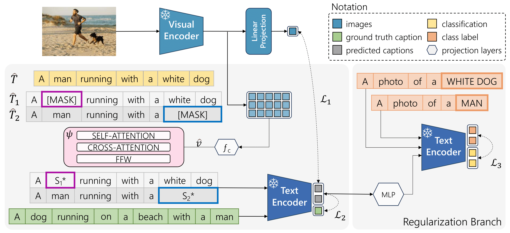

<div align="center">
  <h1>BRIDGE: Bridging Gaps in Image Captioning Evaluation with Stronger Visual Cues (ECCV 2024) </h1>

  
</div>

This repository contains the reference code for the paper [BRIDGE: Bridging Gaps in Image Captioning Evaluation with Stronger Visual Cues](), **ECCV 2024**.

Please cite with the following BibTeX:
```
@inproceedings{sarto2024bridge,
  title={{BRIDGE: Bridging Gaps in Image Captioning Evaluation with Stronger Visual Cues}},
  author={Sarto, Sara and Cornia, Marcella and Baraldi, Lorenzo and Cucchiara, Rita},
  booktitle={Proceedings of the European Conference on Computer Vision},
  year={2024}
}
```
<p align="center">
  
</p> 
 
